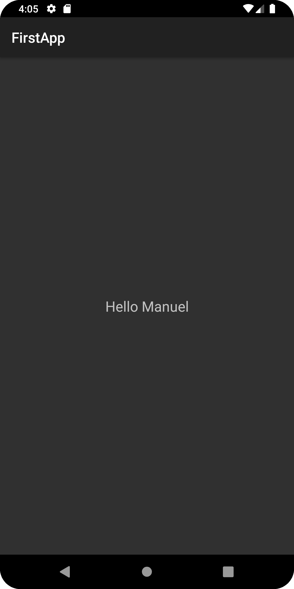

# FirstAppKotlin
## Overview

**FirstAppKotlin** is a simple Android application developed using Kotlin. The primary functionality of the app is to display a user's name on a new activity screen upon entering it and clicking a button.

## Features

- User enters their name.
- On button click, a new activity is launched displaying the entered name.

## Screenshots

<p align="center">
  
  
</p>

## Getting Started

To get a local copy up and running, follow these simple steps.

### Prerequisites

- Android Studio
- Kotlin 1.3+

### Installation

1. Clone the repo
   ```sh
   git clone https://github.com/manuelcobos24/FirstAppKotlin.git
   ```
2. Open the project in Android Studio.
3. Build and run the project on an Android device or emulator.

## Usage

1. Launch the app.
2. Enter your name in the provided text field.
3. Click the button to navigate to a new screen where your entered name will be displayed.

## Contributing

Contributions are what make the open-source community such an amazing place to learn, inspire, and create. Any contributions you make are **greatly appreciated**.

1. Fork the Project
2. Create your Feature Branch (`git checkout -b feature/AmazingFeature`)
3. Commit your Changes (`git commit -m 'Add some AmazingFeature'`)
4. Push to the Branch (`git push origin feature/AmazingFeature`)
5. Open a Pull Request